author: Brian Carranza
summary: Laboratorio sobre el modelo entidad relación
id: InstallSQL
tags: guide, relationship, entity
categories: Modelo, Diseño
environments: Web
status: Published
feedback link: https://github.com/01-2022-Bases-de-datos-UCA/Codelabs/issues

# Instalación de SQL

## Descargar SQL Developer

En el siguiente enlace puede enontrar el sitio web para descargar SQL server:
[Link de descarga de SQL Server](https://www.microsoft.com/es-es/sql-server/sql-server-downloads).
En nuestro caso vamos a seleccionar la versión de **Desarrolador**, que es la que sale en la imagen abajo a la izquierda.(Haga clic en **Descargar ahora**).

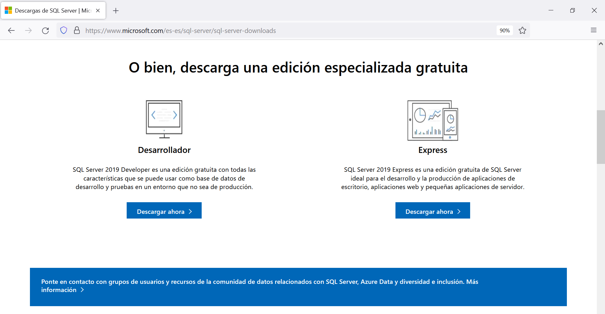

## Instalación de SQL Developer

Ejecute el instalador:

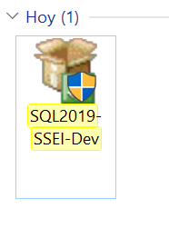

Esto ejecutará la interfaz de instalación, en esta seleccione el tipo de instalación **Básica**:

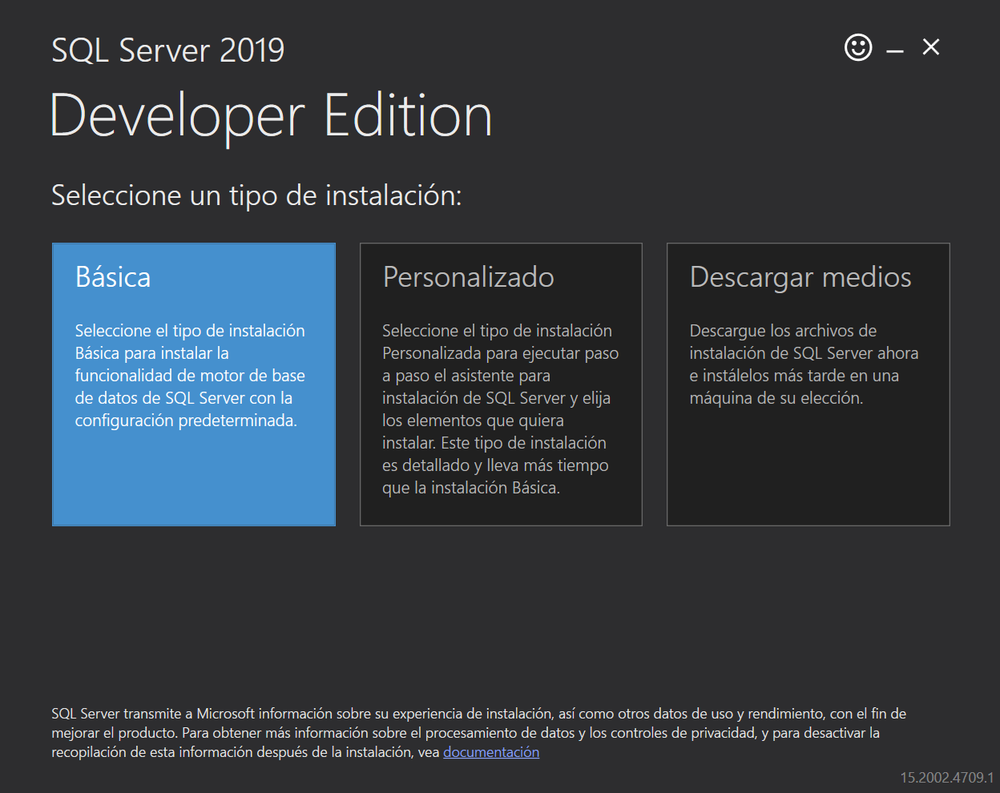

Esto mostrara una ventana de idioma de insterfaz de usuario, selecione **Sí** (Esto solo sucede si no posee inglés):

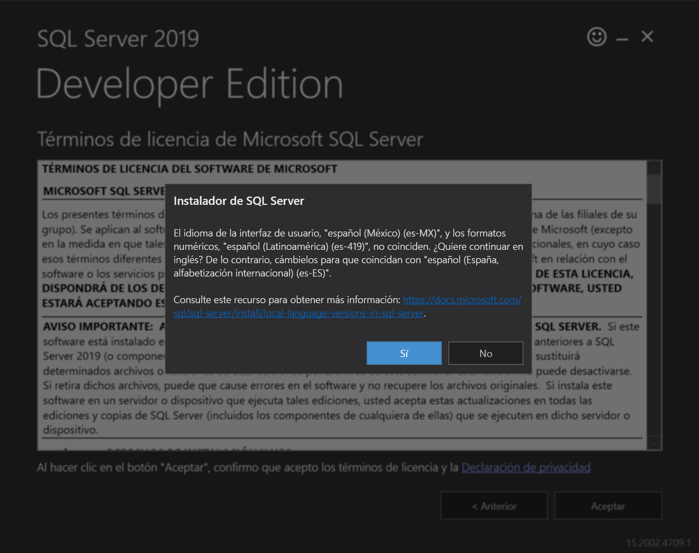

A continuación leea los terminos y condiciones, luego presione el botón **Aceptar**.

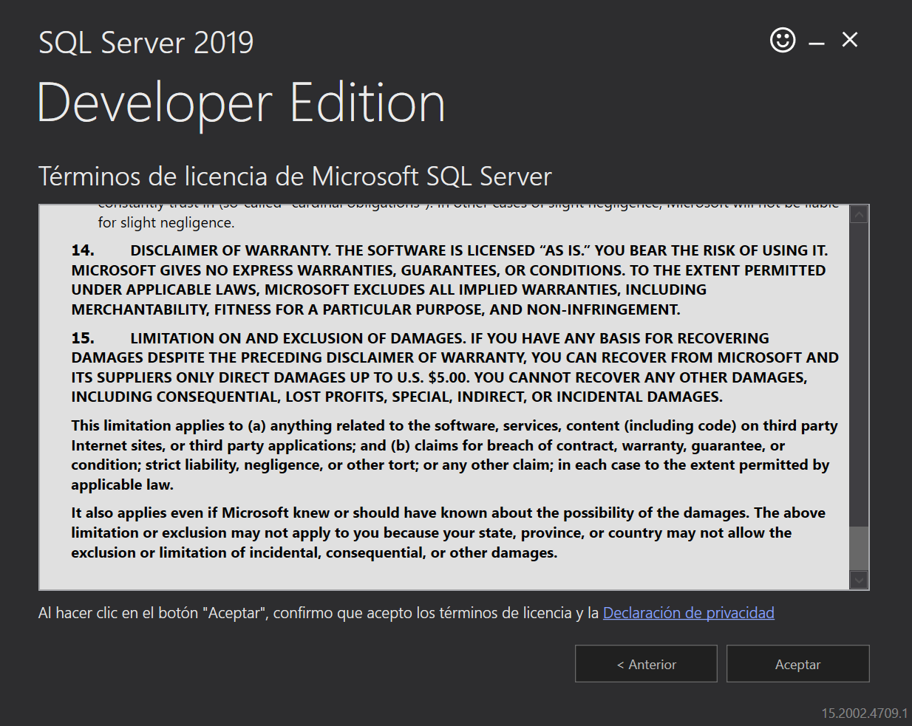

Se recomienda dejar la carpeta por defecto para la instalción y luego presionar **Instalar**. 

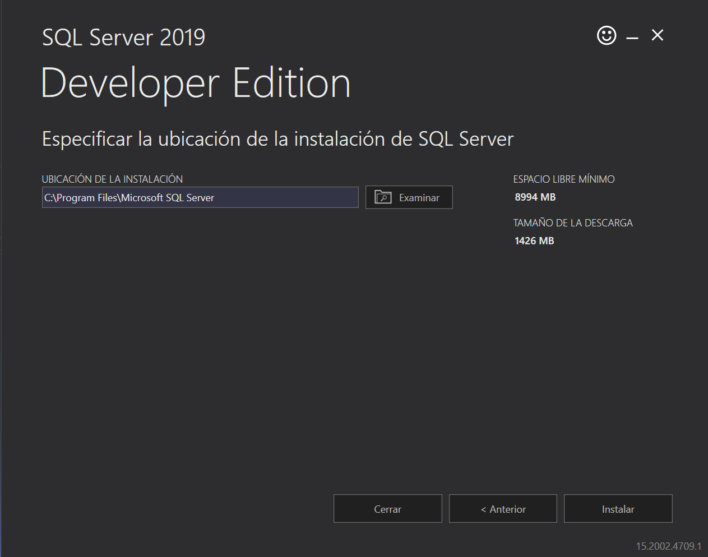

Espere a que se instalen todos los archivos...

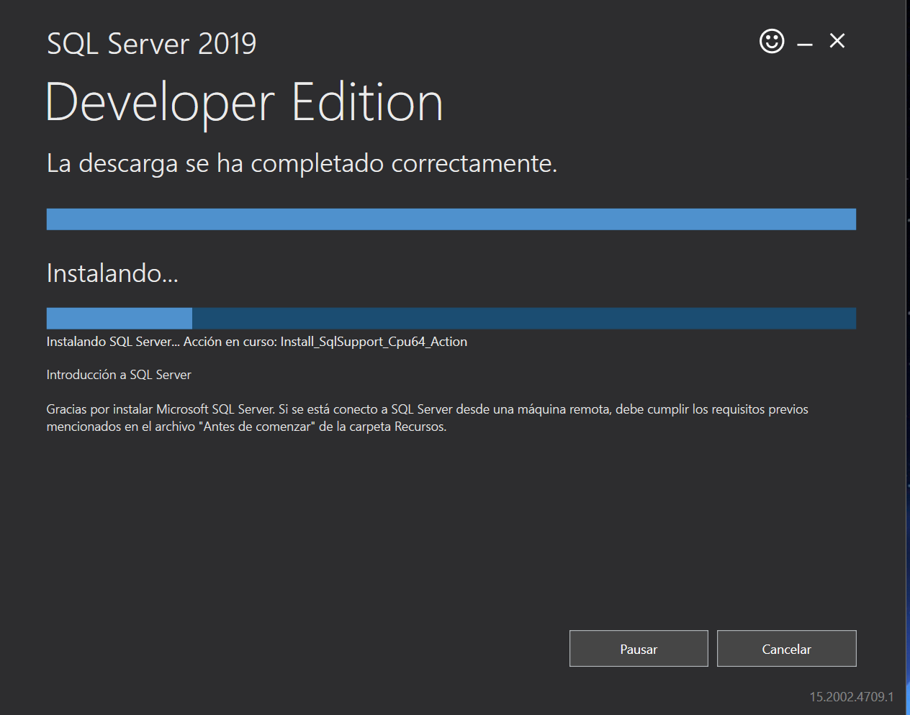

Se mostrará la pagina donde podrá confirmar que todo se instalo correctamente.
Aquí seleccione la opción **Instalar SSMS**, la cual nos dirigirá al sitio web para descargar SSMS.

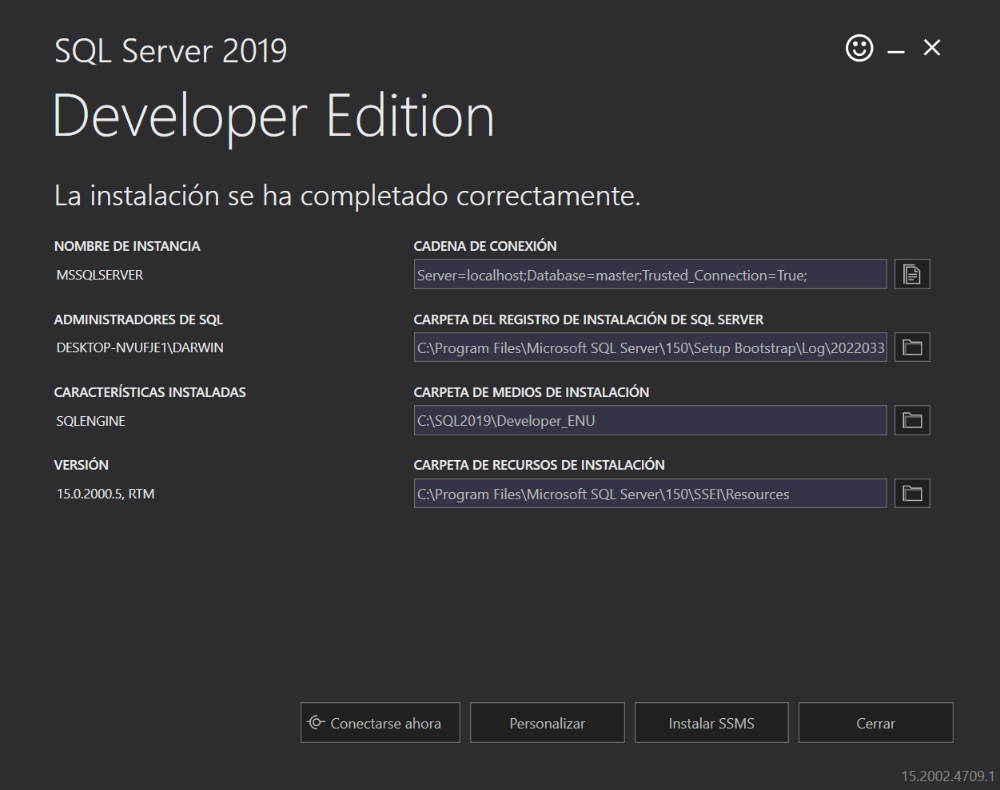

## Descarga de SMSS

### SQL Server Management Studio (SSMS)

El siguiente enlace nos muestra donde podemos descargar SSMS (el cual es el mismo al que nos dirige el paso anterior):
[Link de SSMS](https://docs.microsoft.com/en-us/sql/ssms/download-sql-server-management-studio-ssms?view=sql-server-ver15#download-ssms).
Aquí nos vamos a Downland SSMS y buscamos donde dice **Free Downland for SQL Server Management Studio (SSMS)**.

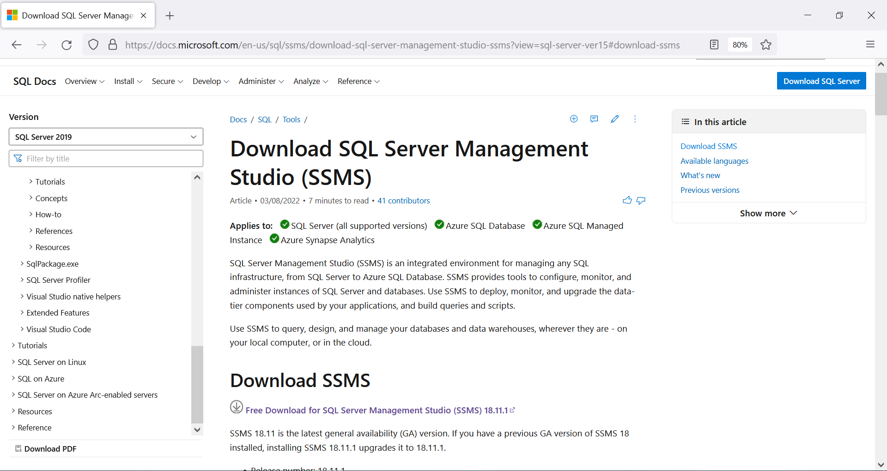

## Instalación de SSMS

Ejecute el instalador:

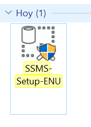

Dejar la carpeta de instalación por defecto y presionar **Install**.

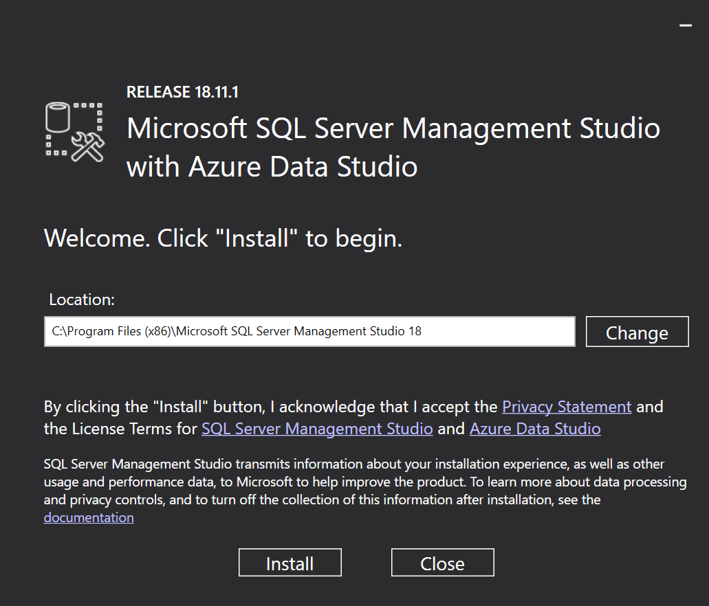

Espere a que se instalen todos los archivos...

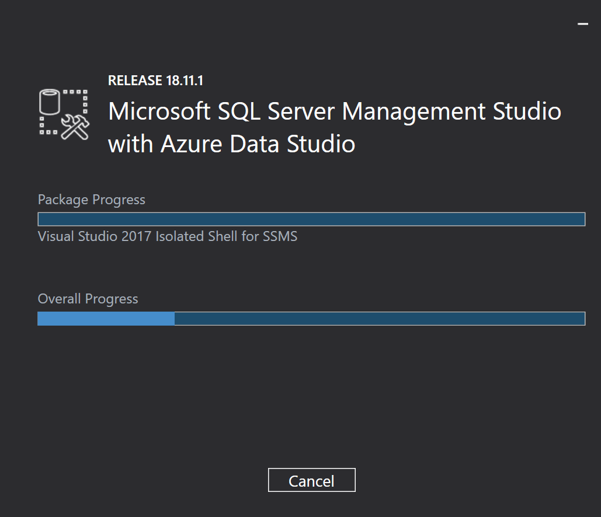

Al finalizar le mostrará que todo se instalo correctamente, solamente presione **Close** y el programa estará listo para usar.

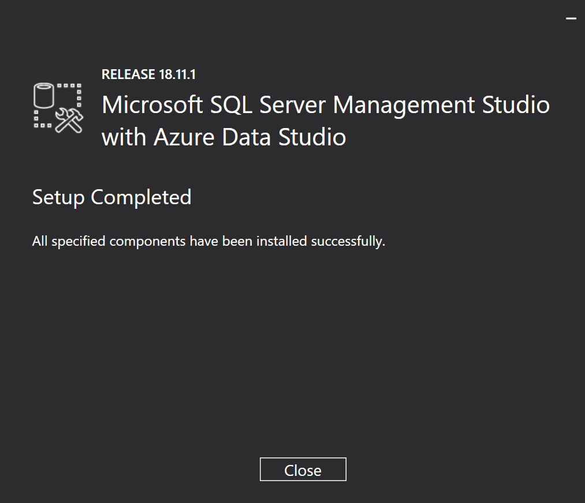

## Abrir SSMS

Ya esta todo listo para usar, por lo que podemos buscar la aplicación escribiendo **SQL**.

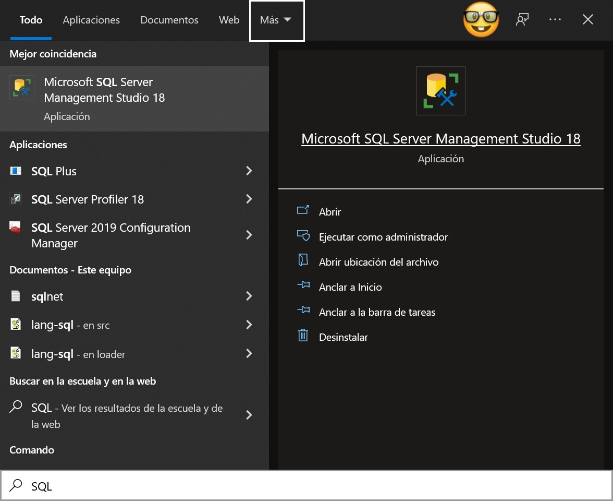

Se abrirá SSMS, selecione **Connet** y nuestro programa estará listo para que comencemos aprender.

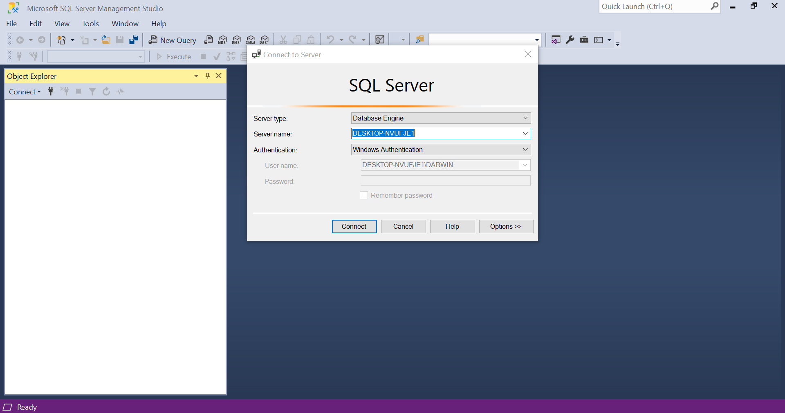

## Autores

Autores:  
  **Versión 1:**
Brian Darwin Carranza Campos (00136020@uca.edu.sv)  
  **Responsables:**
Erick Varela Guzmán (evarela@uca.edu.sv), Douglas Hernández Torres (dohernandez@uca.edu.sv), 
Correspondencia: evarela@uca.edu.sv

Departamento de Electrónica e Informática, Universidad Centroamericana José Simeón Cañas, La Libertad, El Salvador.

Versión de este documento: Versión 1, 2022.

 This work is licensed under a [Creative Commons Attribution-NonCommercial-ShareAlike 4.0 International License](http://creativecommons.org/licenses/by-nc-sa/4.0/).